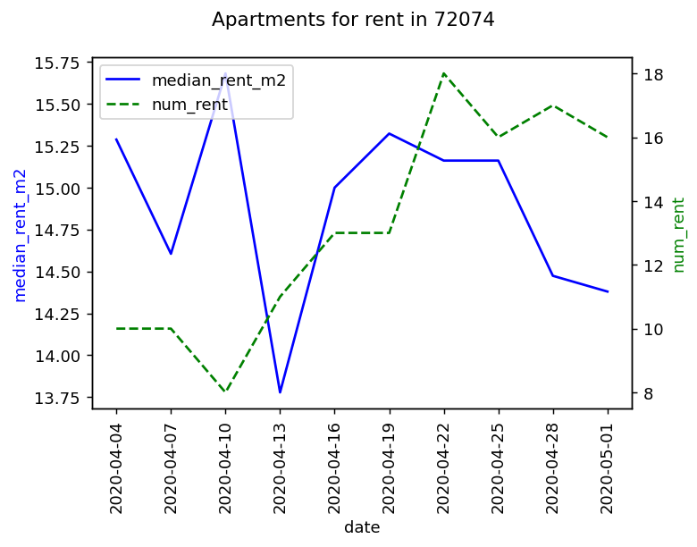
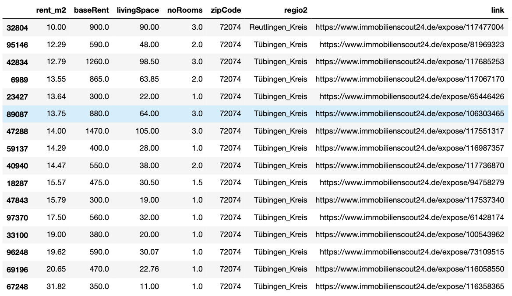

# ApartmentListings
Scrape and analyse apartment listings for rent and sale from Germanys most popular housing website [Immobilienscout24.de](https://www.immobilienscout24.de/) with Python.

## Features
Visualize median rents and number of listings in a zip code or district:  



Check all current listings in a zip code or district ordered by rent per square meter:  



Compare median sale prices with median rent prices in all zip codes or districts


## Installation
After cloning the repository you can easily use Pipenv to set up a virtual environment. It will read from Pipfile and Pipfile.lock in code/ to install all necessary packages:
```
cd code/
pipenv install
```

## How to use the Scraper?
Run scraper.py in an active Pipenv shell which will store a .csv file in a new data/ folder in the main repository directory after running:
```
cd code/
pipenv shell
python scraper.py
```
Use the --type option to get rent listings (mieten) or sale listings (kaufen)
```
python scraper.py --type mieten
python scraper.py --type kaufen
```

## How to do the data analysis?
There are two predesigned jupyter notebooks in the data_analysis/ folder available. They can be opened in a browser by 
```
cd code/
pipenv shell
cd ../data_analysis
jupyter notebook
```
Both notebooks will access data from the data/ folder created by the scraper. They clean the data and show some interesting results. At least one .csv file each with rent and sale listings is needed.

## Main python packages used
 - Webscraper: BeautifulSoup4 and Requests
 - Data analysis: Pandas and Matplotlib
 - For a full list check the Pipfile!

## Tests
to be implemented

## Credits
Inspired by [this](https://statisquo.de/2017/11/16/immobilienscout24-mining-teil-1-worum-geht-es/) series of blog posts.

## License
GNU General Public License
