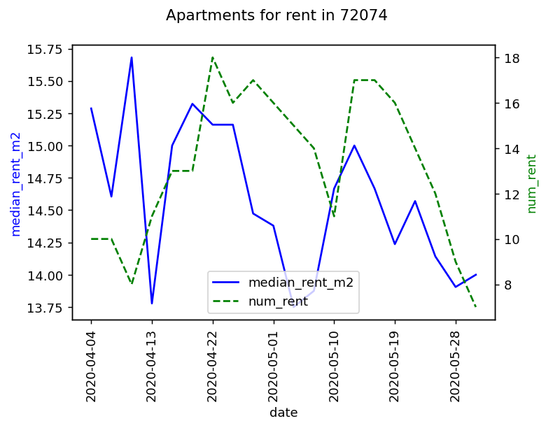
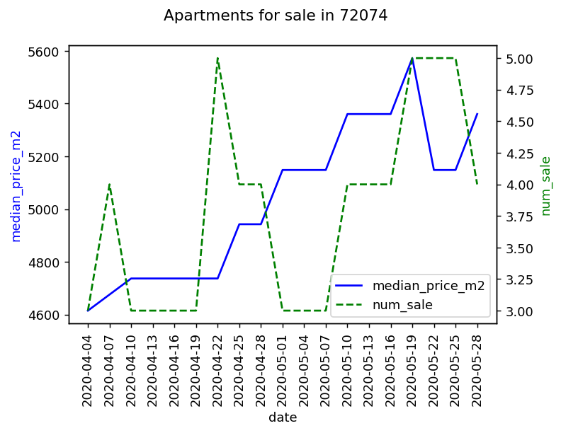
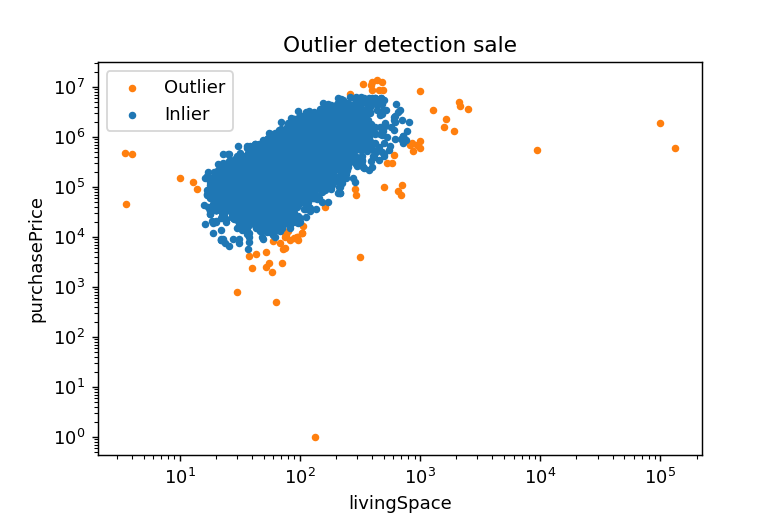

# ApartmentListings
Scrape and analyze apartment listings for rent and sale from Germanys most popular housing website [Immobilienscout24.de](https://www.immobilienscout24.de/) with Python.

## Motivation
Get the apartment listings for all of Germany. The scraper will go through every individual listing expose, exctract the most important parameters and store them in a .csv file.

## Features
Median rents over time:



Median saleprices over time:



Gaussian outlier detection:



## Installation
After cloning the repository you can use Pipenv to set up a virtual environment. Pipenv itself can be installed with pip:
```
pip install pipenv
```
Pipenv will read from Pipfile and Pipfile.lock in the main directory to install all other necessary packages:
```
cd ApartmentListings/
pipenv install
```

## How to use the Scraper?
Run scraper.py in an active Pipenv shell. It will save a .csv file in a new data/ folder in the main repository directory after running:
```
pipenv shell
cd code/
python scraper.py
```
Use the --type option to get rent listings (mieten) or sale listings (kaufen)
```
python scraper.py --type mieten
python scraper.py --type kaufen
```

## How to do the data analysis?
There are two predesigned jupyter notebooks in the data_analysis/ folder available. They can be opened in a browser by
```
pipenv shell
cd data_analysis/
jupyter notebook
```
Both notebooks will access data from the data/ folder created by the scraper. They clean the data and show some interesting results. At least one pair of .csv files with rent and sale listings from the same date are needed.

## Main python packages used
 - Webscraper: BeautifulSoup4 and Requests
 - Data analysis: Numpy, Pandas, Matplotlib and Scikit-learn

## Tests
to be implemented

## Credits
Inspired by [this](https://statisquo.de/2017/11/16/immobilienscout24-mining-teil-1-worum-geht-es/) series of blog posts.
